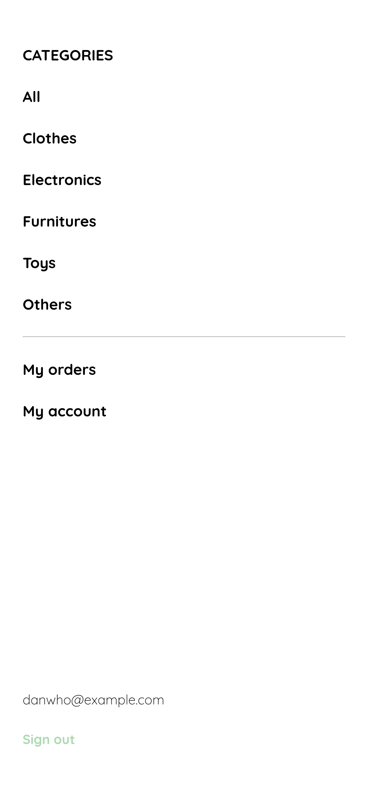

### [Platzi] Curso Práctico Frontend Dev - Proyecto de maquetación para venta de Garage 

Pasos proximos: Llevarlos a componentes para React y unirlos para producto funcional.

# SOLO TEMPLATE

<h6 style='color: #ACD9B2'>Login:</h6>

  

  

<h6 style='color: #ACD9B2'>Forgot my Password:</h6>

  

  
    

<h6 style='color: #ACD9B2'>Create new Password:</h6>

  

  
    

<h6 style='color: #ACD9B2'>Create account:</h6>

  

  
    

<h6 style='color: #ACD9B2'>Home:</h6>

  

  
    

<h6 style='color: #ACD9B2'>Menu:</h6>

  

  
    

<h6 style='color: #ACD9B2'>My Account:</h6>

  

  
    

<h6 style='color: #ACD9B2'>My Order:</h6>

  

  
    

<h6 style='color: #ACD9B2'>My Orders:</h6>

  

  
    

<h6 style='color: #ACD9B2'>Navbar:</h6>

  

  
    

<h6 style='color: #ACD9B2'>Product:</h6>

  

  
    

<h6 style='color: #ACD9B2'>Shopping Cart:</h6>

  

  
    

